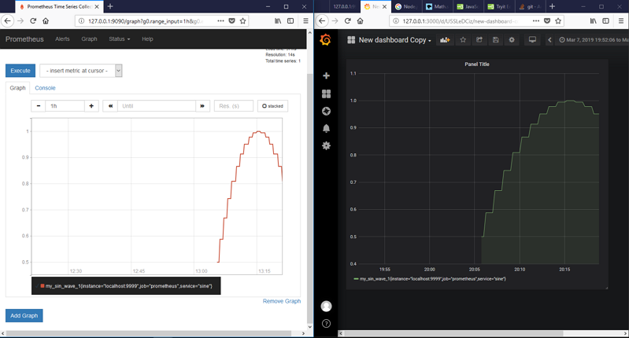
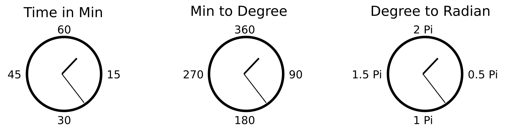

## Goal

get Minute using Node.JS

## Steps

1. `npm install` and `npm start`
2. Call http://127.0.0.1:9999/sine
3. Call http://127.0.0.1:9999/metrics
4. Create Metrics in Prometheus http://127.0.0.1:9090
4. Create Graph in Grafana http://127.0.0.1:3000
***

***
